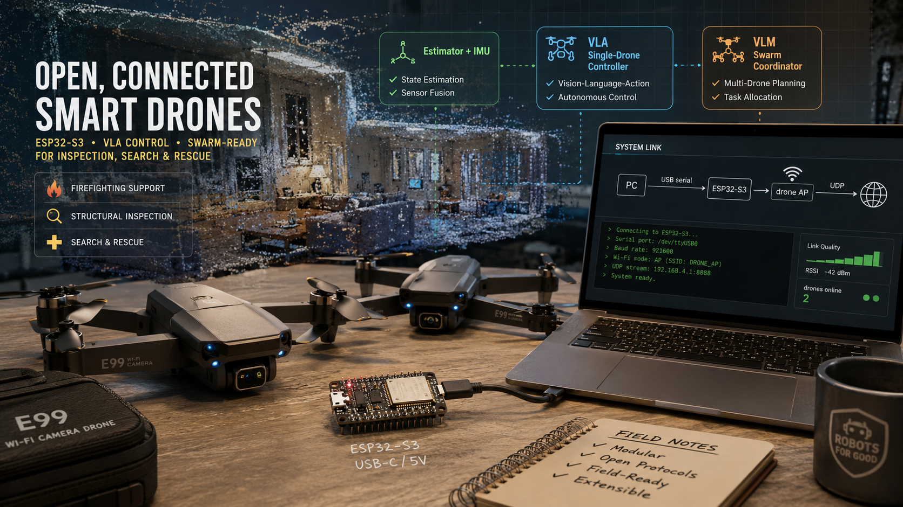

# Drone Control



Local control-station experiments for small `WIFI_8K-*` / E99-style AP-mode
camera drones. The current system can control a drone either directly from a PC
Wi-Fi interface or through an ESP32-S3 USB bridge that joins the drone AP for
the computer.

The important result is the link abstraction:

```text
high-level control -> DroneAction -> PacketProtocol -> DroneLink
                                                     -> direct UDP
                                                     -> ESP32-S3 serial bridge
```

That lets the same Python control loop mix link types. For example, a run can
control two drones through two ESP32 bridges and a third through a direct PC
Wi-Fi interface.

## What Works

- ESP32-S3 bridge firmware builds and flashes with PlatformIO.
- ESP-side Wi-Fi scan finds drone APs without changing the PC Wi-Fi network.
- PC-to-ESP serial framing handles USB reset noise and CRC-checks messages.
- ESP bridge joins one drone AP and forwards UDP control packets.
- Direct UDP and ESP serial links share the same `DroneLink` interface.
- `single.py` and `swarm.py` can run through either link type.
- The Electron manual IO panel can configure direct UDP or ESP serial output.
- The camera path can decode the observed RTSP/RTP/JPEG stream into frame
  records.
- Pose-track and Gaussian-splat reconstruction surfaces exist for recorded
  frame sequences.

## Hardware Model

These drones expose their own Wi-Fi access points. A normal controller joins
that AP and sends UDP control packets to the drone, commonly at
`192.168.1.1:7099`.

Direct PC control works for one drone per PC Wi-Fi interface:

```text
PC Wi-Fi -> drone AP -> UDP control
```

The ESP32 bridge keeps the PC on its normal network:

```text
PC -> USB serial -> ESP32-S3 -> drone AP -> UDP control
```

Use one ESP32 per drone AP. One ESP32 does not associate with multiple drone APs
at the same time.

## Quick Start

Install Node dependencies once:

```bash
npm install
```

Build the ESP32-S3 bridge firmware:

```bash
cd firmware/esp32_drone_link
pio run
```

Flash a connected ESP32-S3 bridge:

```bash
cd firmware/esp32_drone_link
pio run -t upload --upload-port /dev/ttyACM0
```

Scan drone APs through the ESP32 without touching the PC Wi-Fi:

```bash
python3 tools/esp_scan.py --port /dev/ttyACM0
```

Run a short neutral control stream through the local ignored config:

```bash
python3 -m drone_control.swarm --config config/drones.local.json --command neutral --seconds 0.5
```

Run the Electron control station:

```bash
npm start
```

Packet output is disabled by default in the app unless manual IO is explicitly
enabled and configured.

## Configuration

Tracked example:

- [config/drones.example.json](config/drones.example.json) shows mixed
  `esp_serial` and `udp` drone links.

Local runtime config:

- `config/drones.local.json` is ignored by git. Use it for real SSIDs, serial
  ports, and passwords.
- `.drone.env` is ignored by git. Use it for local service overrides and
  secrets.

Example ESP serial entry:

```json
{
  "id": "drone1",
  "link_type": "esp_serial",
  "serial_port": "/dev/ttyACM0",
  "serial_baud": 921600,
  "ssid": "WIFI_8K-3e67bc",
  "password": "",
  "ip": "192.168.1.1",
  "port": 7099,
  "protocol": "wifi_8k_prefixed_short"
}
```

## Repository Map

- `app/`: Electron renderer HTML/CSS/JS.
- `electron/`: Electron main process and preload bridge.
- `drone_control/`: Python service, protocols, transports, camera, pose, and
  reconstruction code.
- `firmware/esp32_drone_link/`: PlatformIO ESP32-S3 bridge firmware.
- `tools/`: capture, scan, probe, conversion, and verification utilities.
- `config/`: tracked example configs. Local configs are ignored.
- `docs/`: architecture and video/story documentation.
- `DRONE_RUNBOOK.md`: operational notes and observed protocol details.

## Key Docs

- [docs/video_narrative.md](docs/video_narrative.md): viewer-facing story for a
  technical video, from discovery to future architecture.
- [docs/control_station_architecture.md](docs/control_station_architecture.md):
  system architecture and service boundaries.
- [DRONE_RUNBOOK.md](DRONE_RUNBOOK.md): operational log, packet findings, camera
  notes, and test commands.
- [firmware/esp32_drone_link/README.md](firmware/esp32_drone_link/README.md):
  ESP32-S3 bridge details.

## Verification

Run the local checks:

```bash
python3 -m py_compile \
  drone_control/transport.py \
  drone_control/config.py \
  drone_control/swarm.py \
  drone_control/single.py \
  drone_control/manual_transport.py \
  drone_control/service.py \
  tools/test_transport.py \
  tools/test_service_manual_ack.py \
  tools/esp_scan.py

python3 -m unittest tools.test_transport tools.test_service_manual_ack
python3 tools/test_smooth_camera_frames.py
npm run check
python3 -m drone_control.swarm --config config/drones.example.json --dry-run --seconds 0.2
```

Build firmware:

```bash
cd firmware/esp32_drone_link
pio run
```

## Project Narrative

This repo is also the source material for a technical video. The arc is:

1. Start with inexpensive AP-mode camera drones.
2. Learn the phone app's UDP/RTSP protocol.
3. Hit the single-radio laptop limitation.
4. Try direct Wi-Fi and multi-radio approaches.
5. Move each drone AP association onto an ESP32-S3 bridge.
6. Keep high-level control code link-agnostic.
7. Point toward a civilian robotics stack: real-time scene/state estimation,
   single-drone VLA control, and VLM-level multi-drone coordination for
   firefighting support, inspection, search-and-rescue training, and
   environmental monitoring.

See [docs/video_narrative.md](docs/video_narrative.md) for the full outline.
